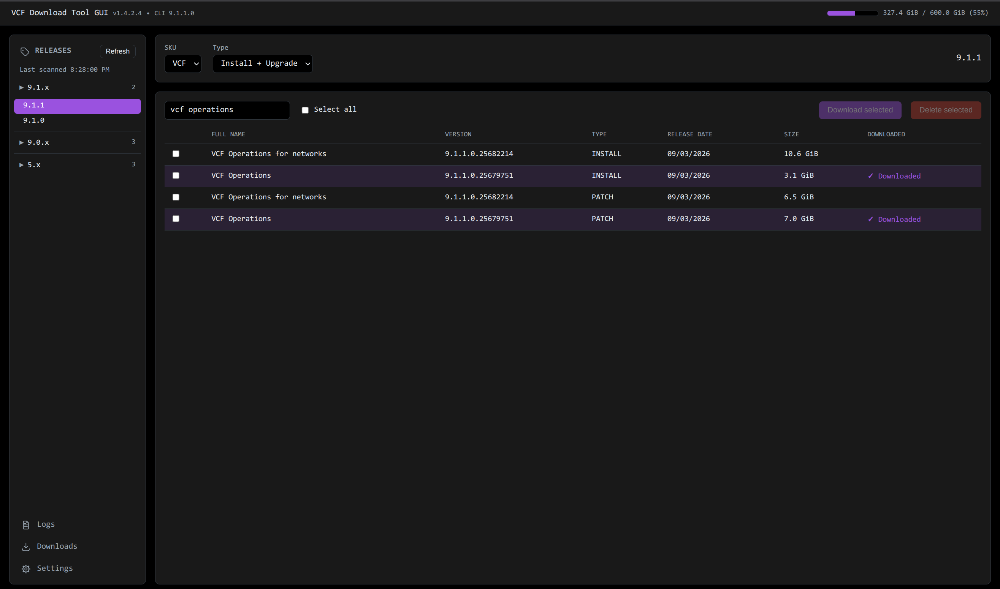
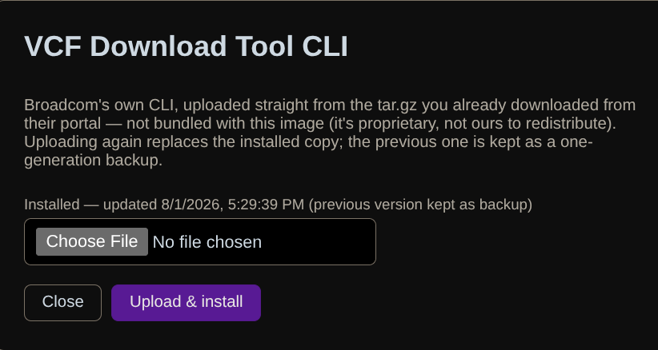
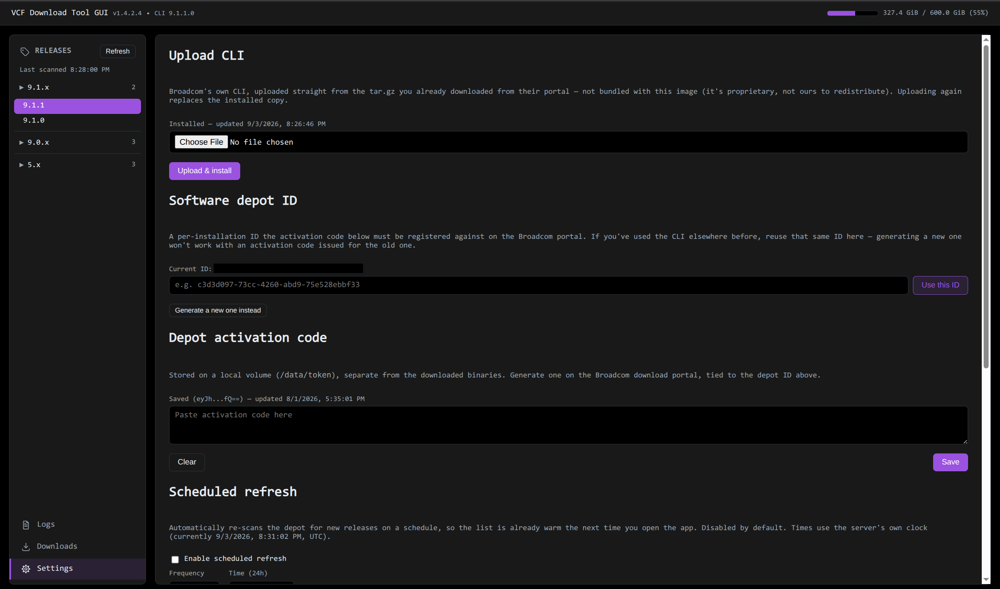
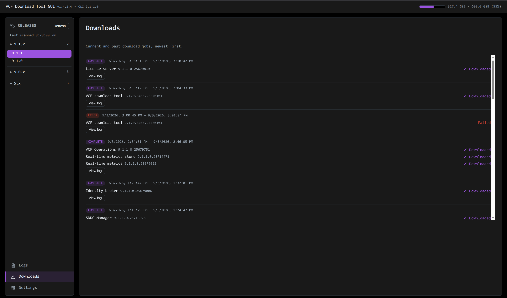

# VCF Download Tool GUI

A web GUI wrapper around Broadcom's `vcf-download-tool`, because it cant 
just be me who hates the CLI tool, cant remember the commands and wants
something pretty <3.

# Features

- Turns the VCF download tool from Broadcom into an easy to use GUI application
- Easily generate an ID with a ready to use link for depot registration at vcf.broadcom.com
- Upload your own CLI, easily upgrades or adds CLIs from the UI
- Colour customisation - One of my favourites
- Shows downloaded files on the depot volume * Should work properly
- Shows disk usage for the downloads volume
- Containerised platform - Tested with docker, should work on K8S
- Delete files on the depot volume
- Filtered by versions
- CLI version displayed in the GUI
- Searchable downloads list
- Filter by patch/upgrade files and install files
- Order by release date, size and downloaded columns

## Pictures









## Running

`docker-compose.yml` contains a default port binding and two key volumes,
the default yaml has a data directory for storing the download token when
generated, and the CLI tool which can be added and updated in the GUI.  
There is also a mount for the download data, you can have this attached
to whatever you want, I use NFS as my offline depot also mounts it,
I have included my default but you can change this out for anything that
works for you.
```
services:
  vcf-download-tool-gui:
    image: ghcr.io/leaha00/vcf-download-tool-gui:latest
    container_name: vcf-download-tool-gui
    restart: unless-stopped
    ports:
      - "8080:8080"
    volumes:
      # Also where the CLI itself lives once you upload it through the GUI's
      # "Upload CLI" button - see README.md "Bring your own CLI". No
      # separate volume needed for it.
      - vcf-token:/data/token
      - vcf-depot:/mnt/vcf-depot
    environment:
      PORT: "8080"
      # Lowest VCF major.minor to scan for release discovery. Everything at
      # or above this is picked up automatically as Broadcom ships it.
      RELEASE_SCAN_START_VERSION: "9.0"
      # UID/GID the app runs as - defaults to 1000:1000, which just works
      # for a fresh depot share. Only set these if your NFS depot has
      # pre-existing content owned by someone else (`ls -l` the mount to
      # check); set them to match its owner. No rebuild needed either way.
      # See README.md "Permissions".
      PUID: "${PUID:-1000}"
      PGID: "${PGID:-1000}"

volumes:
  # Local, container-host-backed volume for the activation code - kept
  # separate from the depot store on purpose.
  vcf-token:
    driver: local

  # NFS-backed volume for downloaded binaries. Requires nfs-common (or
  # equivalent) on the Docker host so the local volume driver can mount it.
  vcf-depot:
    driver: local
    driver_opts:
      type: nfs
      o: "addr=192.168.1.4,nolock,soft,rw"
      device: ":/mnt/Sol/General/vcf-depot"

```
```
docker compose up -d
```

This starts the GUI on `http://localhost:8080` with:

- `vcf-token` (local Docker volume) — holds the activation code, the
  per-installation "software depot ID", and (since v1.3.0) the CLI itself
  once you upload it. Kept separate from the downloaded binaries on purpose.
- `vcf-depot` (NFS volume) — eg `192.168.1.4:/mnt/Sol/General/vcf-depot`, where
  downloaded binaries land. Requires `nfs-common` (or equivalent) on the
  Docker host so the `local` volume driver can mount it, and `nfsvers=3`
  (this share doesn't answer on v4).

## Bring your own CLI

This image doesn't and won't ever bundle Broadcom's `vcf-download-tool` -
every file in it is headed `Copyright ... Broadcom Confidential`, so it's not
ours to redistribute. There's no bind mount for it either - upload it
straight through the GUI instead:

1. Download the CLI yourself from the Broadcom portal (you need this
   regardless - it's the same login the activation code comes from). Don't
   extract it - keep the `.tar.gz` as-is.
2. In the GUI, click **Upload CLI** (top right) and choose that file.

It's extracted into the `vcf-token` volume, validated (the extracted CLI has
to actually run `--version` successfully before anything is swapped into
place), and used from there - no host filesystem access, no bind mount, no
`docker-compose.yml` changes, and it works identically in Kubernetes with
just a PVC for `/data/token` (no second PV needed for the CLI). Uploading
again later (a new Broadcom release) replaces the installed copy the same
way; the previous one is kept as a one-generation backup rather than
deleted outright.


## First-time setup

Open the GUI and click **Settings**:

1. **Software depot ID** — the CLI ties every activation code to a
   per-installation UUID that has to be registered on the Broadcom portal.
   If you've used the CLI before (e.g. on the host), paste that same ID in
   under "Current ID" rather than generating a new one — a freshly generated
   ID won't be registered against your existing activation code and auth
   will fail. Otherwise, click "Generate a new one instead" and follow the
   registration link it gives you - wait a min for the link to appear.
2. **Activation code** — paste the code from the Broadcom download portal
   and save. It's written to `/data/token/activation-code.txt` inside the
   `vcf-token` volume.

## Using it

- **Releases** panel discovers every released VCF version dynamically by
  querying the depot with an open-ended range (`--vcf-version=9.0..`,
  configurable via `RELEASE_SCAN_START_VERSION`) and grouping by
  major.minor.patch family. New releases show up automatically the next
  time the cache refreshes (15 min TTL, or hit **Refresh**) — no code
  changes needed.
- **Manual version** input lets you query an arbitrary VCF version directly.
- Pick SKU (VCF/VVF) and Type (Install/Upgrade/Both), select binaries by
  checkbox, then **Download selected**. Progress streams live via
  Server-Sent Events.
- The bar in the top center shows the depot store's disk usage (via
  `fs.statfs` on `DEPOT_DIR`), refreshing every 30s normally and every 3s
  while a download is active.

Note: the CLI only reliably supports exact version pinning for GA releases
(`a.b.c.0`); async patch builds (`a.b.c.0100`, `.0200`, ...) return nothing
when queried exactly even though they show up fine in the family listing.
The backend detects this and automatically falls back to the full
`a.b.c.x` family query, with a toast explaining what happened.
